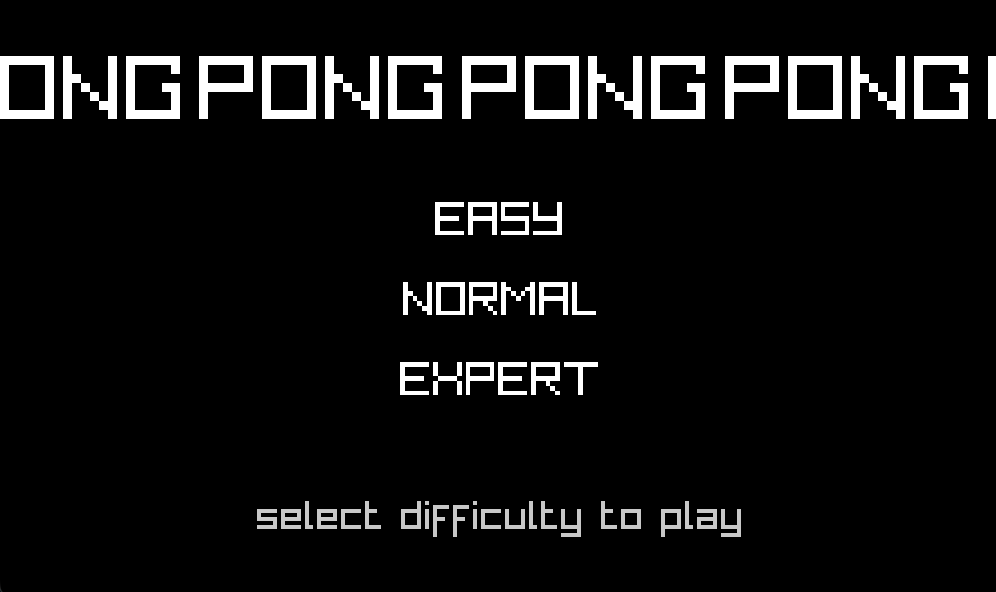
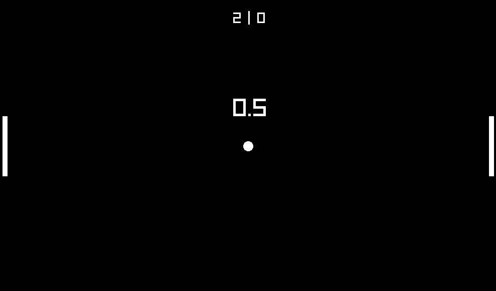

# 🕹️ Pong (Single Player)

**Small 1-player Pong written in C using raylib.**
This is my first game with multiple difficulty levels.
*(Don’t bother with “Hard”… the AI is unbeatable!)*

---

|  |  |
| :-----------------------------: | :-----------------------------: |
|          Menu                   |              Game               |

---

### 🧰 Built with

* **C**
* **raylib**

---

### 📦 How to build

You’ll need **raylib** installed.
Then just compile and run:

```
gcc main.c -lraylib -o pong
./pong
```
